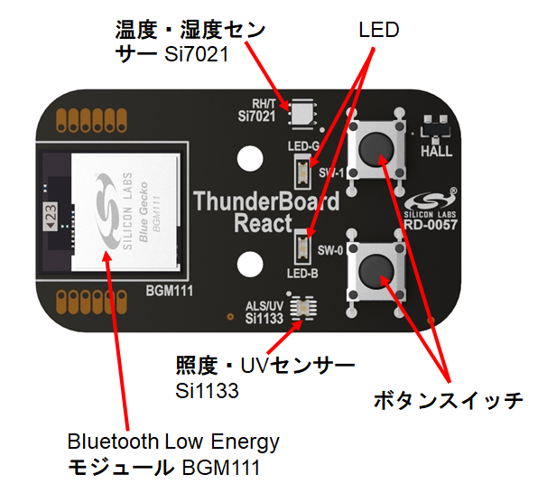
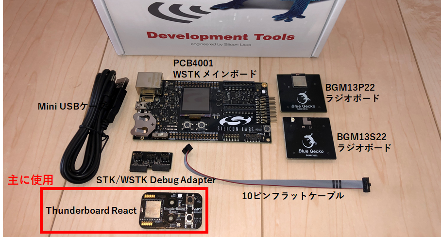
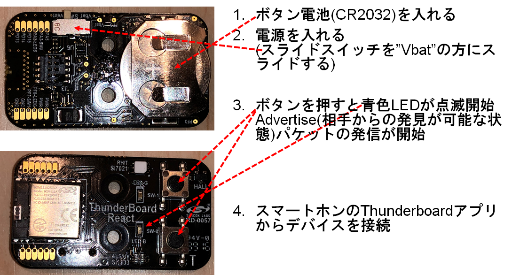
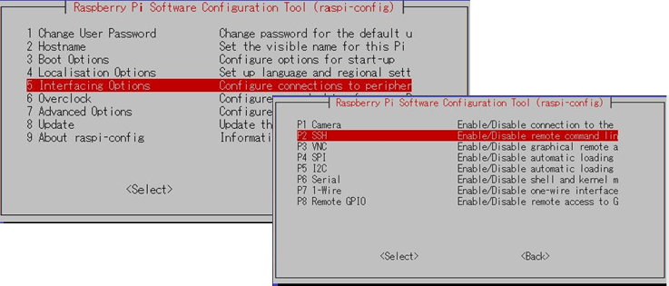
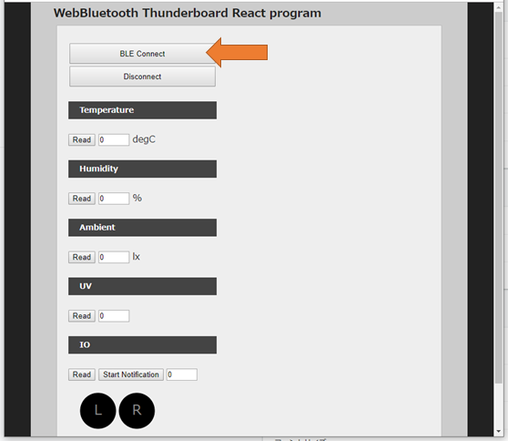
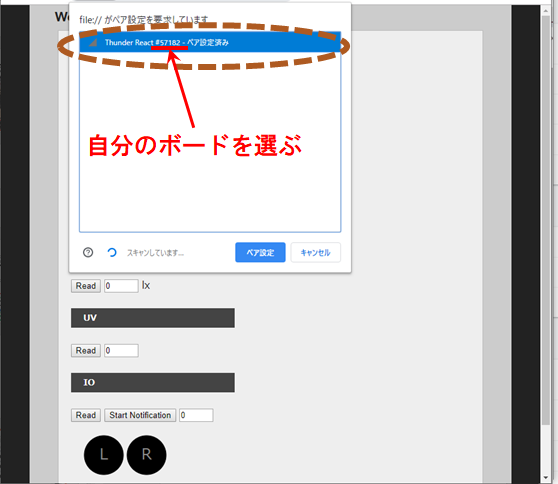
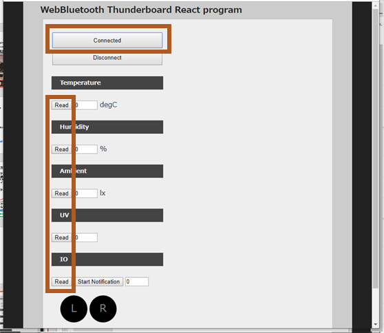
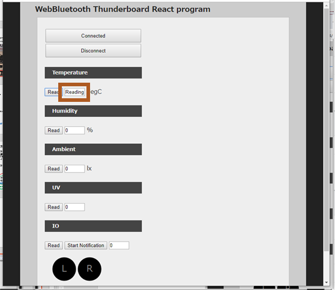
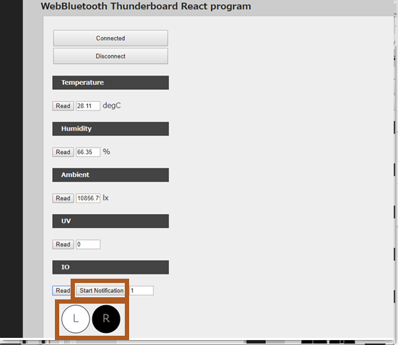
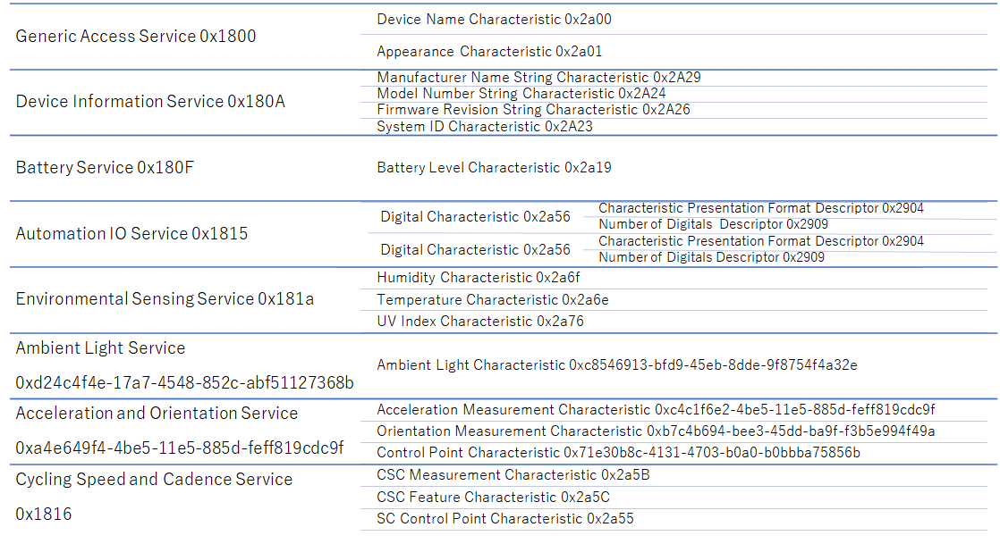

# Web x IoT メイカーズチャレンジ　Appendix
## Silicon Labs Thunderboard React をChirimenで活用しよう

### Silicon Labs Thunderboard Reactとは?
シリコン・ラボが開発者向けに用意したリファレンスセンサーデザイン  

搭載センサー
* Si7021 温度・湿度センサー
* Si1133 照度・UVセンサー
* Input/Output: ボタンスイッチ, 青・緑 LED
* Si7201 ホールセンサー (今回は使用しない)
* Invensense社製 MPU-6500  6軸ジャイロ加速度センサー (裏面/今回は使用しない)

回路図  
https://www.silabs.com/documents/public/schematic-files/TB-React-IST-A0057-schematic.pdf

## 使うハードウェア
ハッカソンの各グループに配布した箱の内容を確認する
以下の写真のハードウェア
本資料では、主にThunderboard Reactを使用

## Thunderboard React 基本的な使い方

### スマートホンアプリ  
* [Apple Store](https://apps.apple.com/no/app/thunderboard/id1097181650) 

* [Google Play](https://play.google.com/store/apps/details?id=com.silabs.thunderboard)

このプロジェクトでは、この機能をChirimen(RaspberryPi)で動作させる。
そのため、マルチプラットフォームで使用可能なWebBluetoothを使用したプログラムを作る

## htmlファイルの入手とRaspberry piへの取り込み
本リポジトリからのClone/Downloadができない場合は、Raspberry PiのSSHを有効化してSSH/SCPでファイル転送する

SSHの有効化手順
Raspberry Pi コンソールから、$ sudo raspi-config で開く下図のツールで設定/確認する

## Thunderboard React program (Web Bluetooth)の使い方

1. index.htmlをブラウザChromiumで開く

	方法1:	ターミナルから下記コマンド
		$ chromium-browser index.html

	方法2: Chromiumで、file://[full-path]/index.html で指定

	方法3: ファイルマネージャから、Chromiumへファイルをドラッグ&ドロップ 

1. Thunderboard Reactの接続をする  

1. 現れるWindowsで接続デバイスを選ぶ  

1. Connectedになっていることを確認し、それぞれのセンサーの値を”Read”ボタンで取得  

1. 値が”Reading”の場合はしばらく待つ  

## “Start Notification”ボタンを押し、Notification(通知)機能を試す
1. Thunderboard React上のボタンを押すとL, Rの円の色が変わる  
1. ReadとNotificationの使い分けを理解する  

## Thunderboard React GATT構造

